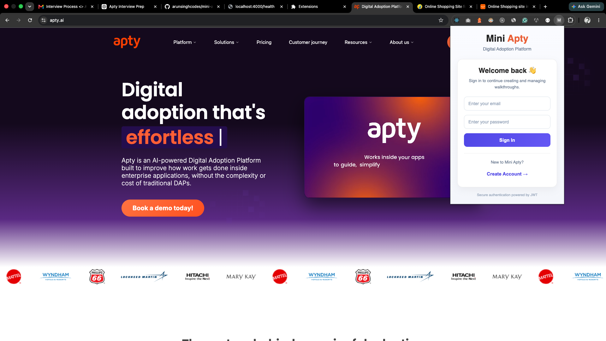
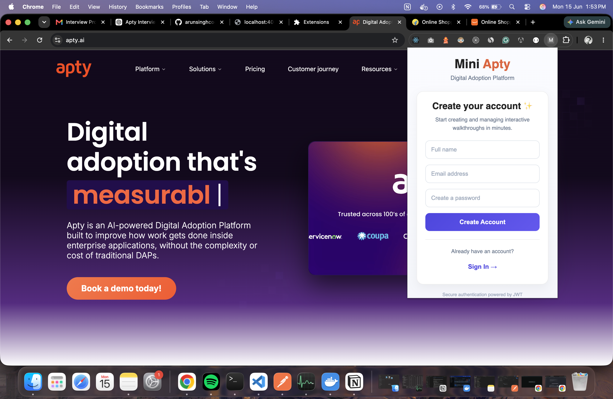
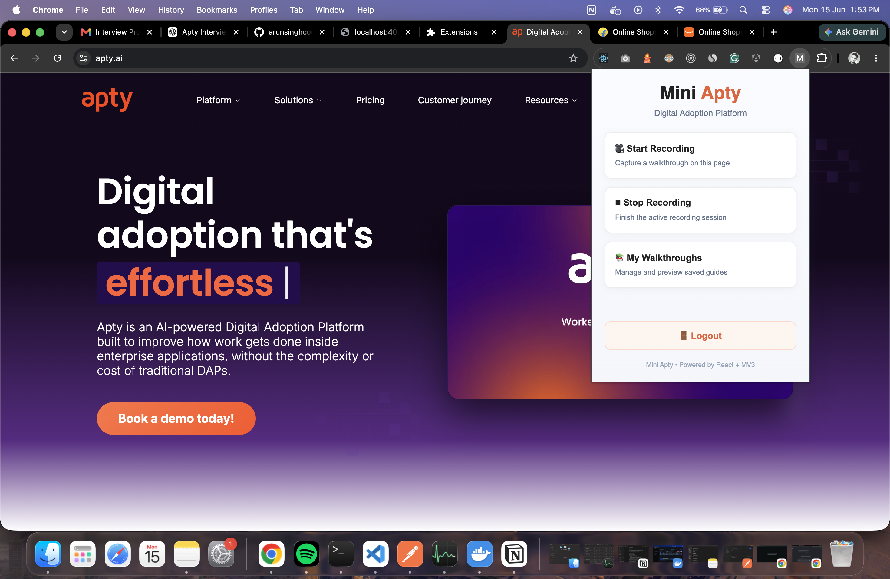
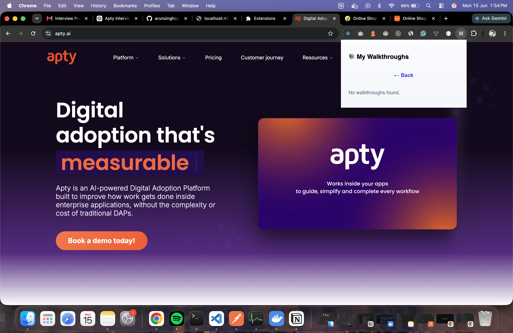
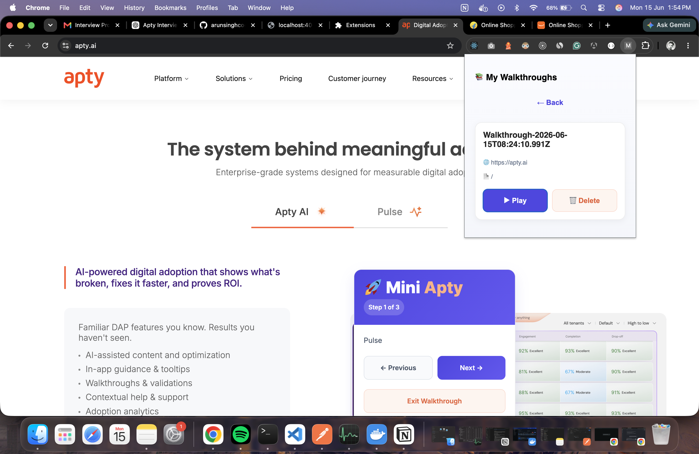
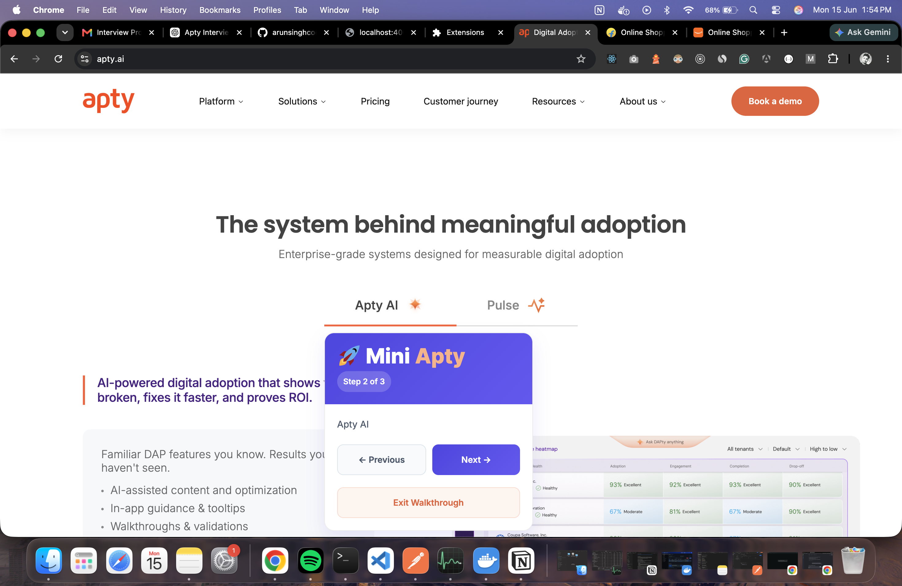
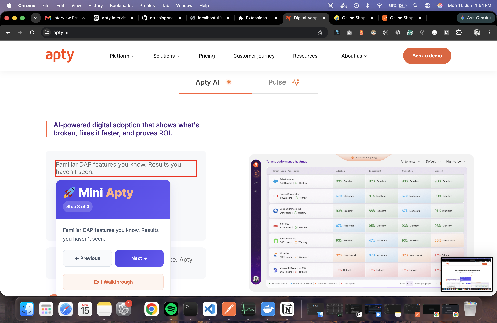

# Mini Apty — Digital Adoption Platform

> A Chrome Manifest V3 extension + Node.js backend that lets authors **record** interactive walkthroughs on any website and **replay** them step-by-step — a deliberate slice of what Apty ships at scale.

Built as part of the **Senior Full Stack Developer Take-Home Challenge**.

---

## 📸 Screenshots

### 🔐 Login



### 📝 Create Account



### 🏠 Home Popup



### 📚 Empty Walkthrough List



### 📚 Walkthrough List



### ▶️ Walkthrough Playback





## Table of Contents

- [Quick Start](#quick-start)
- [Project Structure](#project-structure)
- [Tech Stack](#tech-stack)
- [Architecture](#architecture)
- [Element Targeting Strategy](#element-targeting-strategy)
- [MV3 Service Worker Design](#mv3-service-worker-design)
- [Offline & Network Failure Tolerance](#offline--network-failure-tolerance)
- [Authentication & Authorization](#authentication--authorization)
- [REST API Reference](#rest-api-reference)
- [Overlay Design](#overlay-design)
- [Trade-offs & Design Decisions](#trade-offs--design-decisions)
- [What I'd Do Differently With More Time](#what-id-do-differently-with-more-time)

---

## Quick Start

### Prerequisites

- Node.js >= 20
- pnpm >= 9
- Docker + Docker Compose
- Chrome browser

### 1. Clone & Install

```bash
git clone https://github.com/arunsinghcodes/mini-apty.git
cd mini-apty
pnpm install
```

### 2. Environment Setup

```bash
cp .env.example .env
```

Edit `.env` with your values:

```env
PORT=4000
MONGODB_URI=mongodb+srv://<user>:<password>@cluster.mongodb.net/mini-apty
JWT_SECRET=your-super-secret-key-minimum-32-chars
```

### 3. Start Backend

**Option A — Docker (recommended, single command):**

```bash
docker compose up --build
```

**Option B — Local dev with hot reload:**

```bash
pnpm --filter backend dev
```

Backend runs on `http://localhost:4000`

### 4. Build & Load Extension

```bash
pnpm --filter extension build
```

Then in Chrome:

1. Open `chrome://extensions`
2. Enable **Developer Mode** (top right toggle)
3. Click **Load unpacked**
4. Select `apps/extension/dist/`

### 5. Using the Extension

1. Click the Mini Apty icon in Chrome toolbar
2. **Sign up** or **Sign in**
3. Click **Start Recording** — click elements on the page to capture steps
4. Click **Stop Recording** — walkthrough is saved automatically
5. Click **My Walkthroughs** → **Play** to replay any saved walkthrough

---

## Project Structure

```
mini-apty/
├── apps/
│   ├── backend/                    # Node.js + Express API
│   │   ├── src/
│   │   │   ├── controllers/        # Request handlers
│   │   │   ├── services/           # Business logic
│   │   │   ├── models/             # Mongoose schemas (User, Walkthrough)
│   │   │   ├── routes/             # Express routers
│   │   │   ├── middleware/         # Auth middleware, error handling
│   │   │   ├── auth/               # JWT utilities
│   │   │   └── db/                 # MongoDB connection
│   │   ├── Dockerfile              # Multi-stage Docker build
│   │   └── package.json
│   │
│   └── extension/                  # Chrome MV3 Extension
│       ├── src/
│       │   ├── background/         # MV3 Service Worker
│       │   ├── content/            # Injected content scripts
│       │   │   ├── recorder/       # Element capture (captureElement.ts)
│       │   │   ├── player/         # Walkthrough playback (WalkthroughPlayer)
│       │   │   └── overlay/        # Overlay UI + styles
│       │   ├── popup/              # React popup UI
│       │   │   ├── components/     # Login, Signup, Home, WalkthroughList
│       │   │   ├── store/          # Zustand auth store
│       │   │   └── services/       # Auth + recording services
│       │   ├── api/                # Backend API client
│       │   ├── storage/            # Chrome storage helpers
│       │   └── utils/              # Element targeting + CSS selector
│       ├── manifest.json           # MV3 manifest
│       └── vite.config.ts
│
├── packages/
│   └── shared/                     # Shared TypeScript types
│       └── src/
│           └── domain/             # ElementTarget, Walkthrough types
│
├── docker-compose.yml
├── .env.example
├── pnpm-workspace.yaml
└── tsconfig.base.json
```

---

## Tech Stack

| Layer              | Technology                              |
| ------------------ | --------------------------------------- |
| Extension UI       | React 18, TypeScript (strict)           |
| State Management   | Zustand                                 |
| Extension Platform | Chrome Manifest V3                      |
| Build Tool         | Vite + CRXJS plugin                     |
| Backend            | Node.js, Express 5, TypeScript (strict) |
| Database           | MongoDB Atlas via Mongoose              |
| Authentication     | JWT (jsonwebtoken) + bcrypt             |
| Container          | Docker (multi-stage build)              |
| Monorepo           | pnpm workspaces                         |

---

## Architecture

```
┌─────────────────────────────────────────────────────────┐
│                    Chrome Browser                        │
│                                                         │
│  ┌─────────────┐    messages    ┌──────────────────┐   │
│  │  Popup UI   │◄──────────────►│  Service Worker  │   │
│  │  (React)    │                │  (Background)    │   │
│  └─────────────┘                └────────┬─────────┘   │
│                                          │ messages     │
│                                 ┌────────▼─────────┐   │
│                                 │  Content Script  │   │
│                                 │  ┌────────────┐  │   │
│                                 │  │  Recorder  │  │   │
│                                 │  │  Player    │  │   │
│                                 │  │  Overlay   │  │   │
│                                 │  └────────────┘  │   │
│                                 └──────────────────┘   │
└───────────────────────┬─────────────────────────────────┘
                        │ REST API (http://localhost:4000)
                        ▼
            ┌───────────────────────┐
            │    Express Backend    │
            │  ┌─────────────────┐  │
            │  │  JWT Auth       │  │
            │  │  Walkthroughs   │  │
            │  └────────┬────────┘  │
            └───────────┼───────────┘
                        │
                        ▼
              ┌──────────────────┐
              │  MongoDB Atlas   │
              │  (Remote Cloud)  │
              └──────────────────┘
```

### Message Flow

**Recording:**

```
Popup → START_RECORDING → Service Worker → Content Script
Content Script captures clicks → saves fingerprints in memory
Popup → STOP_RECORDING → Content Script → POST /walkthroughs → Backend
```

**Playback:**

```
Popup → PLAY_WALKTHROUGH (id) → Content Script
Content Script → GET /walkthroughs/:id → Backend
WalkthroughPlayer resolves each element → renders overlay balloon
```

---

## Element Targeting Strategy

> A plain `document.querySelector('div > div:nth-child(3)')` breaks on any SPA re-render. Mini Apty uses a **multi-attribute fingerprint** with priority-based resolution.

### What Gets Captured Per Element

```typescript
{
  tagName: "button",
  id: "submit-btn",               // high confidence
  dataAttributes: {               // highest confidence
    "data-testid": "login-btn"
  },
  ariaLabel: "Submit form",       // high confidence
  name: "submit",                 // high confidence (forms)
  role: "button",                 // semantic
  placeholder: "Enter email",     // inputs
  accessibleText: "Submit",       // text content
  classNames: ["btn", "primary"], // filtered (removes generated classes)
  cssSelector: "#submit-btn",     // structural fallback
  strategy: "id",                 // which strategy was primary
  confidence: 1.0                 // 0.0 → 1.0
}
```

### Resolution Algorithm (Priority Order)

```
1. id                    → confidence 1.0   (fastest, most stable)
2. data-testid / data-cy → confidence 0.95  (authored for stability)
3. aria-label            → confidence 0.90  (semantic, survives redesigns)
4. name attribute        → confidence 0.85  (stable on form inputs)
5. placeholder           → confidence 0.80  (inputs)
6. accessible text       → confidence 0.75  (text content match)
7. CSS selector          → confidence 0.50  (structural fallback)
```

### CSS Selector Generation

The CSS path builder intelligently filters out unstable classes:

```typescript
// These class prefixes are skipped (auto-generated, unstable):
// elementor-, e-, wp-, vc_, js-, swiper-, slick-, css-
// Classes longer than 40 chars are also skipped
// Path stops early when a stable parent ID is found
```

### getBestElement

Before capturing, the recorder walks up the DOM to find the nearest interactive ancestor:

```typescript
// Prefers: button, a, input, textarea, select, [role="button"]
// Falls back to the clicked element itself
getBestElement(clickedElement);
```

This prevents capturing a `<span>` inside a `<button>` — we always want the actionable element.

---

## MV3 Service Worker Design

MV3 service workers terminate after ~30 seconds of inactivity. Mini Apty handles this through:

### Message-based Architecture

All communication is event-driven via `chrome.runtime.onMessage`:

```
START_RECORDING  → content script starts capturing clicks
STOP_RECORDING   → content script saves walkthrough to backend
PLAY_WALKTHROUGH → content script fetches + replays walkthrough
```

### Service Worker Lifecycle

The background script is kept minimal — it registers the install listener and relays messages. Heavy work (DOM manipulation, API calls) happens in the content script which has its own lifecycle tied to the page.

---

## Offline & Network Failure Tolerance

Walkthroughs are cached in Chrome storage after every successful fetch:

```typescript
// Cache key format: "walkthrough:{origin}:{pathPattern}"
await chrome.storage.local.set({
  [`walkthrough:${origin}:${pathPattern}`]: walkthrough,
});
```

**Network-first strategy:**

1. Try fetching from backend
2. On success → update cache → return data
3. On failure → return cached data if available
4. Player works fully offline once a walkthrough has been loaded once

---

## Authentication & Authorization

### Flow

```
POST /auth/signup  →  validate → hash password (bcrypt, 10 rounds) → return JWT
POST /auth/login   →  verify password → return JWT (7 day expiry)
All /walkthroughs  →  verify JWT in Authorization: Bearer <token> header
```

### 401 vs 403 Distinction

| Status | Code         | When                                        |
| ------ | ------------ | ------------------------------------------- |
| `401`  | UNAUTHORIZED | Missing, expired, or invalid JWT            |
| `403`  | FORBIDDEN    | Valid JWT but user doesn't own the resource |
| `404`  | NOT_FOUND    | Resource genuinely doesn't exist            |

This distinction is enforced in every walkthrough controller:

```typescript
const exists = await Walkthrough.findById(id);

if (!exists) return res.status(404)...          // doesn't exist
if (exists.ownerId !== userId) return res.status(403)... // wrong owner
```

### Token Storage

JWT is stored in `chrome.storage.local` (not localStorage — unavailable in service workers). Retrieved on every API call via `getToken()`.

---

## REST API Reference

### Auth

```
POST /auth/signup
Body: { name, email, password }
Returns: { success: true, data: { token, user } }

POST /auth/login
Body: { email, password }
Returns: { success: true, data: { token, user } }

GET /auth/me
Headers: Authorization: Bearer <token>
Returns: { success: true, data: user }
```

### Walkthroughs (all require Bearer token)

```
POST   /walkthroughs
       Body: { title, origin, pathPattern, steps[] }
       Returns: { success: true, data: walkthrough } (201)

GET    /walkthroughs
       Returns: { success: true, data: walkthrough[] }

GET    /walkthroughs/:id
       Returns: { success: true, data: walkthrough }
       Errors: 404 NOT_FOUND, 403 FORBIDDEN

PUT    /walkthroughs/:id
       Body: Partial walkthrough fields
       Returns: { success: true, data: updated }
       Errors: 404 NOT_FOUND, 403 FORBIDDEN

DELETE /walkthroughs/:id
       Returns: { success: true, message: "Walkthrough deleted" }
       Errors: 404 NOT_FOUND, 403 FORBIDDEN
```

### Health

```
GET /health
Returns: { status: "ok", service: "mini-apty-backend" }
```

---

## Overlay Design

The walkthrough player injects an overlay `div` into the page with `z-index: 2147483647` (maximum possible):

```css
#mini-apty-overlay {
  position: fixed;
  z-index: 2147483647;
  font-family: Inter, sans-serif;
  /* isolated styles — no inheritance from host page */
}
```

**Element highlighting:** Target elements get a temporary `outline: 3px solid red` which is removed after 2 seconds — no permanent DOM mutation.

**Scroll into view:** Each step smoothly scrolls the target element into the center of the viewport before showing the overlay balloon.

**Positioning:** The overlay balloon repositions itself relative to each step's target element using `getBoundingClientRect()`.

---

## Trade-offs & Design Decisions

### MongoDB Atlas over Local MongoDB

Chose MongoDB Atlas so reviewers need zero local infrastructure — just `docker compose up` starts the backend and it connects to the remote DB immediately. Trade-off: requires internet connectivity and Atlas account; benefit is truly one-command setup.

### Multi-stage Docker Build

Builder stage compiles TypeScript → runner stage copies only `dist/`. Final image is ~180MB instead of ~800MB. Trade-off: slightly longer initial build, leaner production image.

### CSS Class Filtering in Selector Generation

Generated class names (Tailwind hashes, CSS-in-JS, WordPress prefixes) are filtered out of CSS selectors. Trade-off: selector is less specific but far more stable across deployments and theme changes.

### Zustand over Redux

Shallow component tree in a popup doesn't benefit from Redux middleware. Zustand gives typed global state in ~20 lines. Trade-off: less ecosystem, perfectly sufficient here.

### Content Script for Heavy Lifting

Recording and playback happen entirely in the content script — not the service worker. This avoids MV3 service worker termination issues during long recording sessions. Trade-off: content script runs on every page, kept lightweight (<50KB).

### Chrome Storage over IndexedDB

`chrome.storage.local` is async, works in service workers, and syncs across extension contexts. IndexedDB would be faster for large datasets but adds complexity for no gain at this scale.

### pnpm Workspaces over Turborepo

Simple filter-based builds are sufficient for 2 packages. Turborepo adds caching at CI scale — overkill here. Trade-off: no build caching across runs.

---

## What I'd Do Differently With More Time

1. **MutationObserver for SPA route changes** — Currently the player resolves elements once per step. A persistent observer would handle components that mount/unmount dynamically without page navigation.

2. **Step title/description input during recording** — Currently steps are auto-titled. A proper authoring UI would let users add context to each captured step before saving.

3. **Progress persistence across sessions** — Partially implemented via Chrome storage cache. Full persistence would resume a walkthrough at the exact step after browser restart.

4. **Shadow DOM for overlay isolation** — Current overlay uses a high z-index div which can still be affected by host page `transform` or `filter` CSS on ancestor elements. Shadow DOM would fully isolate styles.

5. **Unit tests for element targeting** — The fingerprint resolution algorithm needs property-based tests against real DOM snapshots from popular SPAs.

6. **CI/CD pipeline** — GitHub Actions for type-check, lint, build, and Docker image push on every PR.

7. **Walkthrough editing UI** — Currently walkthroughs are record-only. A step reorder and edit interface would make it production-ready.

---

## Environment Variables

```env
# Required
PORT=4000
MONGODB_URI=mongodb+srv://<username>:<password>@cluster.mongodb.net/mini-apty
JWT_SECRET=change-me-to-a-strong-32-char-secret

# Generate a strong JWT secret:
# node -e "console.log(require('crypto').randomBytes(32).toString('hex'))"
```

---

## 🎯 Conclusion

Mini Apty demonstrates how a lightweight Digital Adoption Platform can be built using Chrome Manifest V3, React, TypeScript, Express, and MongoDB. It provides an intuitive way to record, manage, and replay interactive walkthroughs, helping users navigate complex workflows efficiently.
